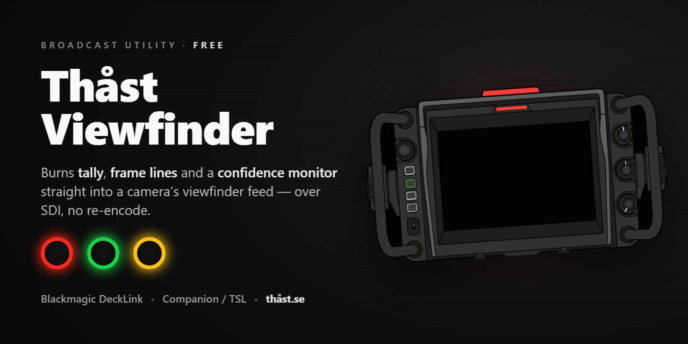

<p align="center">
  
</p>

# Thåst Viewfinder

A free broadcast utility that turns a Windows PC + a Blackmagic **DeckLink** card
into a live **tally / frame-line / confidence-monitor injector** for a camera's
viewfinder feed. It captures the incoming SDI, passes the picture straight through
(no re-encode) and burns in a coloured tally border, framing lines and operator
overlays — driven from a window, a web page, **Bitfocus Companion** over HTTP, or a
**TSL 3.1 UMD** feed.

Built for standalone Blackmagic **URSA Studio Viewfinders**, whose single red
record lamp is otherwise the only tally available over SDI.

> **Free, closed-source utility.** The compiled application is provided here on the
> [Releases](../../releases/latest) page; the source code is not published. Use it
> freely — see [terms](LICENSE).

## Download

[**⬇ Get the latest release**](../../releases/latest) — `ThastViewfinder.exe`,
self-contained, no installer.

- **Requires:** the Blackmagic **Desktop Video** driver (it provides the DeckLink
  runtime) and a DeckLink card. Just run the exe.
- **Verify your download** — SHA-256:
  ```
  da969f21cc0a8f0cdbdc7ec804db5c8c6fd8055e981dc506375c4cf84107e4aa  ThastViewfinder.exe
  ```

## Features

- **Tally Router** — three independent coloured tally channels (red / green /
  yellow) drawn as concentric border rings, the physical viewfinder lamp and its
  arming map, and **R+G = Y** logic for Sony-style triggers (red + green → yellow).
- **Frame Line Inserter** — composition, safe-area, aspect-frame and display
  overlays, burned into the live picture.
- **Monitor Injector** — the passthrough engine; burns the tally and frame lines
  in with no decode/re-encode, and shows a NO-SIGNAL slate when the input drops
  (the physical tally persists through signal loss).
- **Signal Monitor** — live input / output / reference lock and device status.
- **Device I/O** — pick which DeckLink card and which physical connector capture
  and playback use.

## Control

It opens a control **window** and a **web page** at `http://<host>:8090/` that
mirror each other, both driveable from **Bitfocus Companion** over plain HTTP GET.
It can also take tally straight from a vision mixer's or router's **TSL 3.1 UMD**
feed over UDP. The console window is hidden by default; launch with `--console` to
show it.

## How it works (in brief)

A standalone URSA Studio Viewfinder ignores the usual Embedded Tally byte
(DID 0x51 / SDID 0x52). What actually lights its lamp is the camera-control
**record-state** (Blackmagic SDI Camera Control, Media 10.1 = record), so that is
sent as the primary mechanism. Every other tally colour, and all the framing, is
painted **into the picture** instead (the DeckLink card has no hardware keyer) —
interlace-safe and low-latency.

## Terms

Free to use; closed source — see [`LICENSE`](LICENSE).

---

David Thåst · [thåst.se](https://xn--thst-roa.se)
